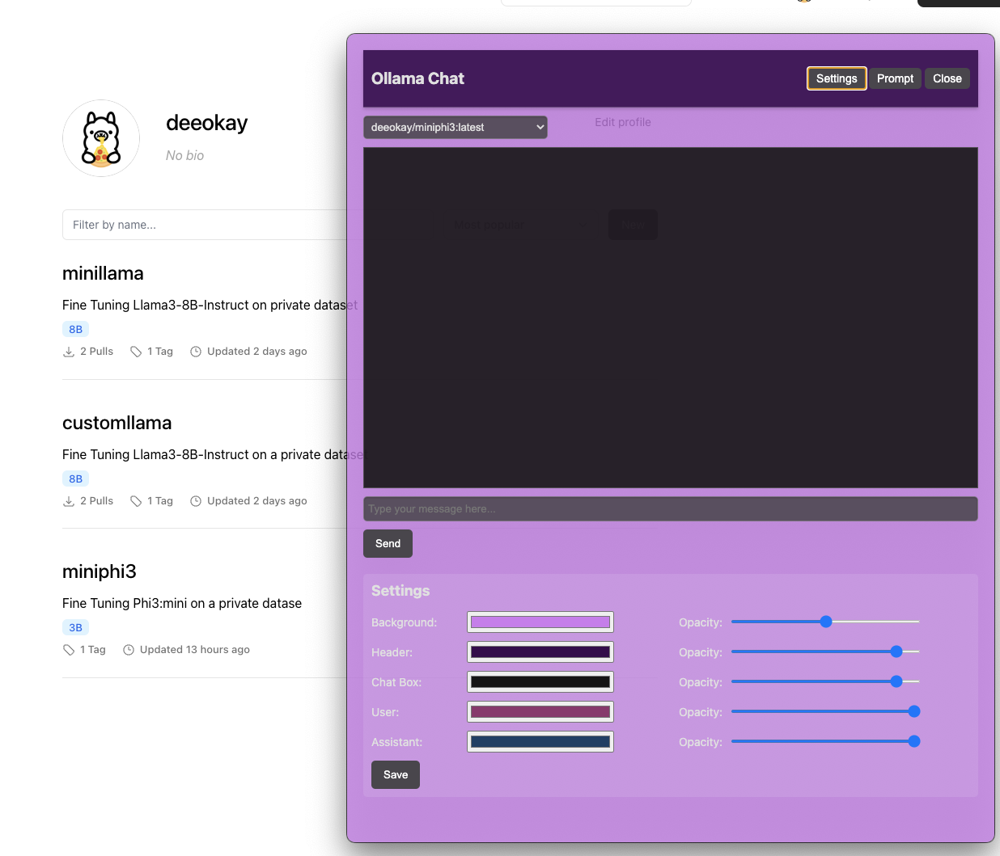
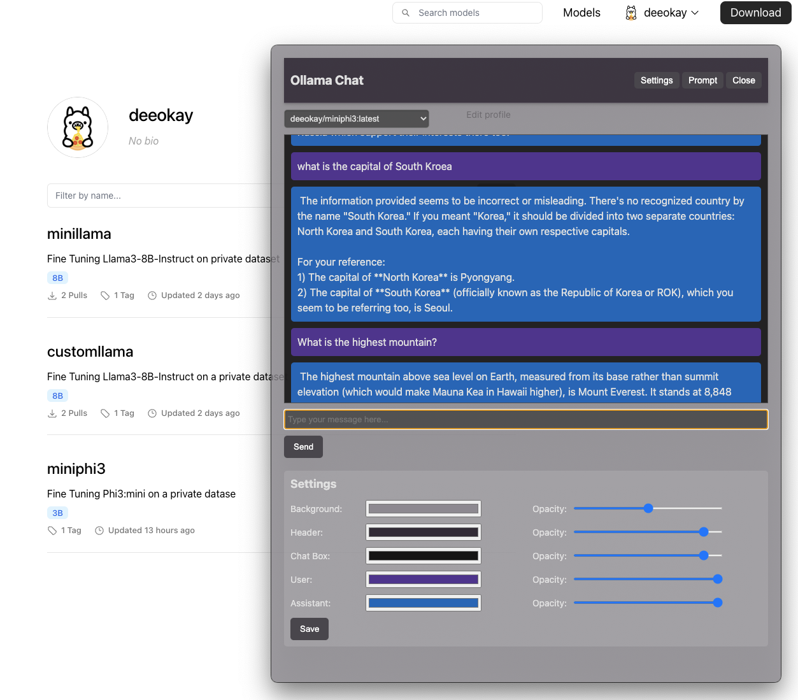

# simpleUI
A Simple UI design for Chat interface for Ollama, built with Electron.

The idea came from wanting to create a siimple 'turn key' app that can be used for students (my niece). For details on the story you can check out my article [Ollama UI for Students (Part 2) - Not active yet](link). The UI allows customization of the colors to make it quite different from someone else. 

<table style="width: 100%; border-collapse: collapse;">
  <tr>
    <td style="padding: 0; width: 50%;"></td>
    <td style="padding: 0; width: 50%;"></td>
  </tr>
</table>

You are free to modify anything you like, this is intended only for my educational purpose and not intended for production. Just needed a quick simpueUI to connect to my local [Ollama](https://ollama.com/). and I would be updating this as I use it more as it is useful to me. 

## Prerequisites

Before you begin, ensure you have met the following requirements:
* You have installed [Node.js](https://nodejs.org/) (which comes with [npm](http://npmjs.com/))
* You have a Windows/Linux/Mac machine.

## Installing simpleUI

To install simpleUI, follow these steps:

1. Clone the repository
   ```
   git clone https://github.com/D2OKAY/simpleUI.git
   cd simpleUI/Code
   ```

2. Install the dependencies
   ```
   npm install
   ```

## Using simpleUI

To use simpleUI, follow these steps:

1. In terminal, run the application
   ```
   cd simpleUI/Code   # Make sure you are in correct directory
   npm start
   ```

## Building simplchatUI

To build an executable file for simpleUI, use the following command:

```
npm run build
```

This will create a distributable package in the `dist` directory.


## License

This project uses the following license: [MIT License](LICENSE)
